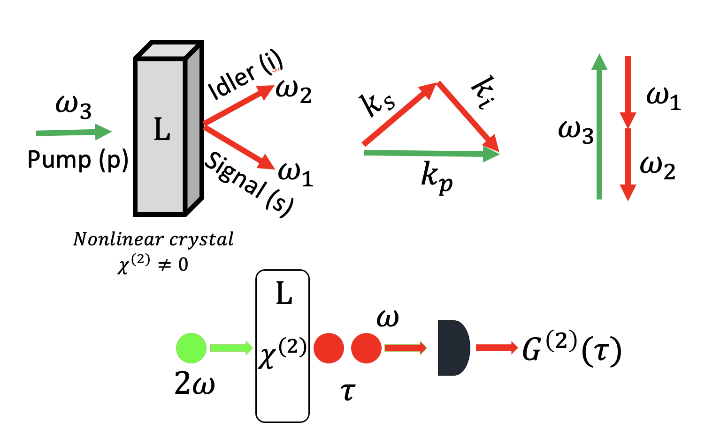

# Spontaneous Parametric Down Conversion (SPDC) 
SPDC occurs when a high intensity laser
pump (p) interacts with a nonlinear crystal and, as a result of the interaction, pairs of low energy photons are spontaneously generated. The pair components are denoted signal(s) and idler(i).
The SPDC process can be divided into types degeneracy and direction. In type-I SPDC, the generated photons have the same polarization while in type-II, the output photons have orthogonal polarization.
The system is collinear if the photons have the same propagation direction as the pump and non-collinear if they propagate in different directions.

  

# Type-I-SPDC
**Flowchart for calculating $d_{eff}$ of any given crystal**

  

## **Phase-Matching + G2 + Photon-Count** 
This folder is all about calculating phase-matching angles, $G^{(2)}$ and pair brightness (Number of entangled photon pairs. There is a file called the ***database*** which has information about all the crystals used in our study. 

Description of database file: 
- Column 1: Name of crystals
- Column 2: Type of crystal
- Column 3: Band gap of the crystal
- Column 4: Signal wavelength for SPDC

After you run deff.sh file, it will produce three files corresponding to the crystal. For example, if the crystal name is RATDAS01, it will produce the following files.

**1: RATDAS01-Count.txt**

nx(w), ny(w), nz(w), nx(2w), ny(2w), nz(2w)

1.545739 1.553462 1.611269 1.564891 1.573036 1.634139

Optimum phase matching: Theta_c ($\theta$) = 142.5 ,Phi_c ($\phi$)  = 29.8, deff (pm/V) =  0.533167931611107

Crystal: Positive biaxial

Photon Count: 1006549.1426916119 s^-1 mW^-1 mm^-1

Correlation time: 1.1659736362620345e-14 s

**2: RATDAS01-phasematching-deff.csv** - This file has all the possible phase-matching angles and deff at those angles. Column 1, Column 2, and Column 3 represent $d_{eff}$, $\theta$, and $\phi$. 

**3: RATDAS01-G2.csv** - This file can be used to plot $G^{(2)}$. Column 1 is $\tau$ $(s)$ and Column 2 is $G^{(2)}$ ($\tau / \tau_o$)

