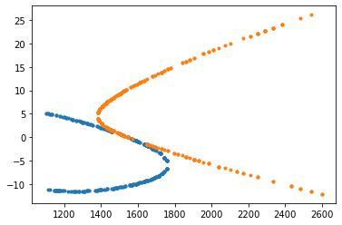
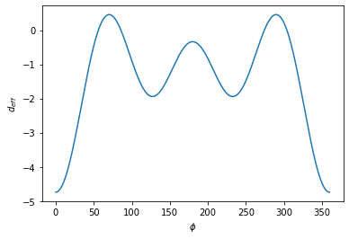
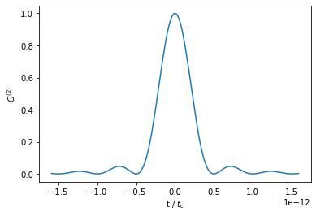

# Type-II-SPDC
Tuning curve script give data about the outside angle of the generated photons per wavelenght, meanwhile Type II uniaxial gives all the data around the Type II SPDC, this is correlation time and single mode photon counting rate for a given wavelenght. 

## **Tuning_curves_MOFs** 
This file use a sellmeier equation of the ordinary and extraordinary refractive indices of the crystal to calculate the value of the optical axis angle that ensure a collinear non-degenerative SPDC and the tuning curves of the crystal, this is the outside angle in which the photons are generated for each wavelenght, at a given pumped wavelenght.

Tuning curve for MOFTIL at 1546

All the data is pre-set to be calculated at 773nm for the pumped wavelenght.

## **Type-II_uniaxial** 
This file use a sellmeier equation given by
$n^{2}(\lambda) = A + \frac{B_1\lambda^{2}}{\lambda^{2}-C_1} + \frac{B_2\lambda^{2}}{\lambda^{2}-C_2}$
to calculate the value of the optical axis angle that ensure a collinear non-degenerative SPDC, then using the $\chi^{(2)}$ the algorithm calculate the azimuthal angle $\phi$ that maximize the $d_{eff}$, then using this $d_{eff}$ and the properties of the crystal the algorithm calculate the Photon counting rate per second, per millimeter length of crystal, per milliwatt of potency pumped.

As an output we get the following images:

$d_{eff}$ v/s azimuthal angle for MOFTIL at 1064

$G^{(2)}$ as a function of the characteristic time for MOFTIL at 1064

All the data is pre-set to be calculated at 532nm for the pumped wavelenght.

